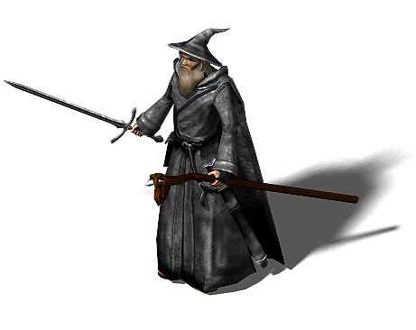

# Mongoose Wizards!


### I decided to build some UI for the MAGIC SPELLS part of the database which I worked on in this assignment of my DCI Course in Web Development. Additionally, I created listing controller with sort and filter options in the backend part.


This assignment will allow you to build a REST API for a magical wizard database!



> Difficulty level: Intermediate 🥸 🏙️

## Keywords

`request parameters`, `query parameters`, `schemas`, `mongoose validation`, `routes`, `endpoints`, `subdocuments`, `references`

## What you will be doing:

> - Mongoose schema validation
> - Mongoose subdocuments
> - Mongoose references

This project assumes you've already had experience with:

> - Mongoose Schemas
> - Building routes and endpoints in Express

## Tasks

Before starting these tasks, run the command `npm install` or `npm i`

This will automatically install the following packages:
- express
- mongoose
- dotenv

## Task 1 - Setting up the .env file

## Task 2 - Connecting your server to your database
## Task 3 - Adding new fields to the Wizard schema

```text
'Ankh-Morpork','Bad Schüschein','Betrek','Borogravia','Brindisi','Chimeria','Chirm','Copperhead','Cori Celesti','Djelibeybi','Ephebe','Ghat','Hersheba','Howondaland','Klatchistan','Lipwig','Rehigreed Province','Schmaltzberg','Skund','Sto Helit','Sto Lat','Sunken Leshp','The Chalk','The Wyrmberg','Überwald'
```

Source: [List of Discworld locations](https://wiki.lspace.org/mediawiki/List_of_Discworld_locations)
## Task 4 - Finishing the MagicSpell schema

```text
'physical', 'arcane', 'fire', 'frost', 'nature', 'shadow', 'holy'
```

Source: [WoW Magic Schools](https://wowpedia.fandom.com/wiki/Magic_schools)

## Tasks 5-12 - Updating Schemas
## Task 13 - Creating the spells


1. Using the `/magic-spell` route (setup in the file `Routes/magic-spell.js`), create an endpoint which will allow the user to create a spell via JSON from a POST request.
   - I would suggest the path `/create` (which together with the route would be `/magic-spell/create`) but feel free to use a path of your choosing, if you so wish.

   - This endpoint should create a new spell in the database
## Task 14 - Create an endpoint to return all magic spell schools

You may have noticed that while trying to test your create magic spell endpoint, you had trouble with the spell schools (remember, you used an `enum` here to validate against an array of strings)

To solve this, we will create a new endpoint that can return all the magic spell schools

1. Inside the `/magic-spell` route, create an endpoint with the path `/schools`. This endpoint should expect a GET request, and should return all the magic spell schools as an array of strings

## Task 15 - Upload spell data
## Task 16 - Creating the wizard's route and endpoints
## Task 17 - Create an endpoint to return all wizard origins

You may have noticed that while trying to test your create wizard endpoint, you had trouble with the origins (remember, you used an `enum` here to validate against an array of strings)

To solve this, we will create a new endpoint that can return all wizard origins

1. Inside the `/wizard` route, create an endpoint with the path `/origins`. This endpoint should expect a GET request, and should return all the wizard origins as an array of strings.

## Task 18 - Upload wizard data
## Task 19 - Create a route to read a spell

1. Inside the `/magic-spell` route, create an endpoint with the path `/details`. This endpoint should expect a GET request, and should expect an id as a param or a query param. The id will be the ObjectId of the spell. It should return all the details of the spell.
   - Use the mongoose model method `findById()`
   - `findById()` expects one argument - the ObjectId of the item you are searching for


## Task 20 - Create a route to read a wizard

1. Inside the `/wizard` route, create an endpoint with the path `/details`. This endpoint should expect a GET request, and should expect an id as a param or a query param. The id will be the ObjectId of the wizard. It should return all the details of a wizard.
   - Use the mongoose model method `findById()`
   - `findById()` expects one argument - the ObjectId of the item you are searching for

## Task 21 - Adding spells to a wizard

A wizard is no fun without spells! We will create an endpoint to allow a wizard to learn a spell

1. Inside the `/wizard` route, create an endpoint with the path `/learn`. This endpoint should expect a PUT request, and should expect two pieces of information - the `id` of the wizard to update and the `id` of the spell they will learn. Both `id`s will refer to the ObjectId.

> Hint: You could send both of these pieces of information as a **parameter** or as part of the **request** `body`

## Task 22 - Level up a wizard

A wizard should be able to level up, when they have enough experience

1. Inside the `/wizard` route, create an endpoint with the path `/levelup`. This endpoint should expect a GET request.
   - Use the mongoose model method `findByIdAndUpdate()`
   - `findById()` expects one argument - an object. Modify the level of the wizard by `+1`